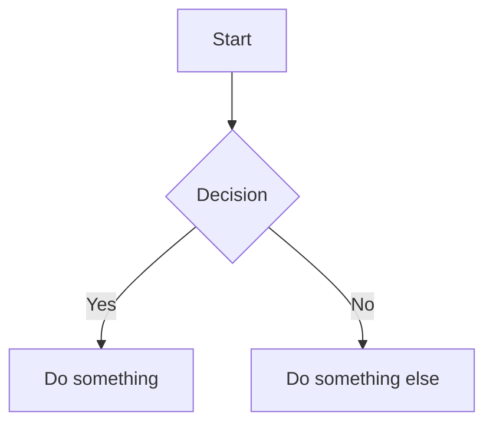

# 🎨 copilot-markdown-canvas

A beautiful read-only Markdown viewer canvas extension for [GitHub Copilot](https://github.com/features/copilot). Renders markdown with stunning typography and **full mermaid diagram support** — optimized for readability.


## ✨ Features

- 📖 **Beautiful typography** — GitHub-flavored markdown with polished styling
- 🧜 **Mermaid diagrams** — flowcharts, sequence diagrams, pie charts, ER diagrams, Gantt charts, and more
- 🌗 **Dark/light theme** — automatically adapts to your Copilot app theme
- 📐 **Optimized diagram layout** — custom spacing, padding, and sizing for maximum readability
- 📄 **File loading** — render any `.md` file from your filesystem
- �� **Live updates** — swap content on the fly via actions

## 🚀 Installation

### From this repo (recommended)

```
Install extension from URL: https://github.com/bradygaster/copilot-markdown-canvas
```

### Manual install

Copy the `extension.mjs` file to:

```
~/.copilot/extensions/markdown-viewer/extension.mjs
```

Then reload extensions in Copilot.

## 🎯 Usage

Once installed, the canvas is available in any Copilot session. The agent can:

**Open with content:**
```
open_canvas({ canvasId: "markdown-viewer", input: { content: "# Hello\n\nWorld" } })
```

**Render a mermaid diagram:**
````markdown

````

**Load a file:**
```
invoke_canvas_action({ instanceId: "...", actionName: "load_file", input: { path: "/path/to/file.md" } })
```

**Update content dynamically:**
```
invoke_canvas_action({ instanceId: "...", actionName: "update_content", input: { content: "# New content" } })
```

## 🧜 Supported Mermaid Diagrams

- Flowcharts (`flowchart`)
- Sequence diagrams (`sequenceDiagram`)
- Class diagrams (`classDiagram`)
- State diagrams (`stateDiagram-v2`)
- Entity-relationship diagrams (`erDiagram`)
- Gantt charts (`gantt`)
- Pie charts (`pie`)
- Git graphs (`gitGraph`)
- And more...

All diagrams are rendered with optimized spacing, font sizes, and color schemes that adapt to your theme.

## 📁 Structure

```
├── extension.mjs          # The canvas extension (single file, no deps)
├── copilot-extension.json # Extension manifest
├── README.md
└── LICENSE
```

## 🛠️ Development

This is a single-file extension — no build step, no dependencies. Edit `extension.mjs` and reload:

1. Make changes to `extension.mjs`
2. In Copilot, reload extensions
3. Re-open the canvas to see changes

## 📄 License

MIT — use it, share it, make it better.
